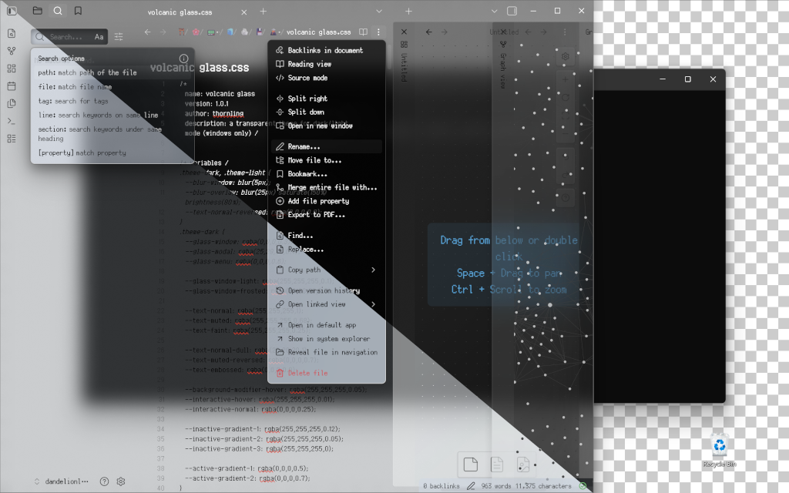
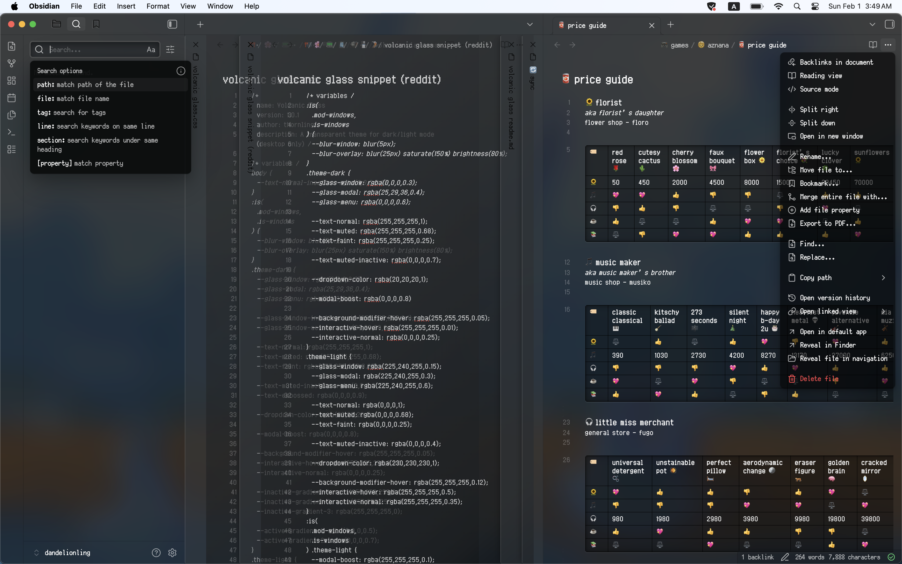
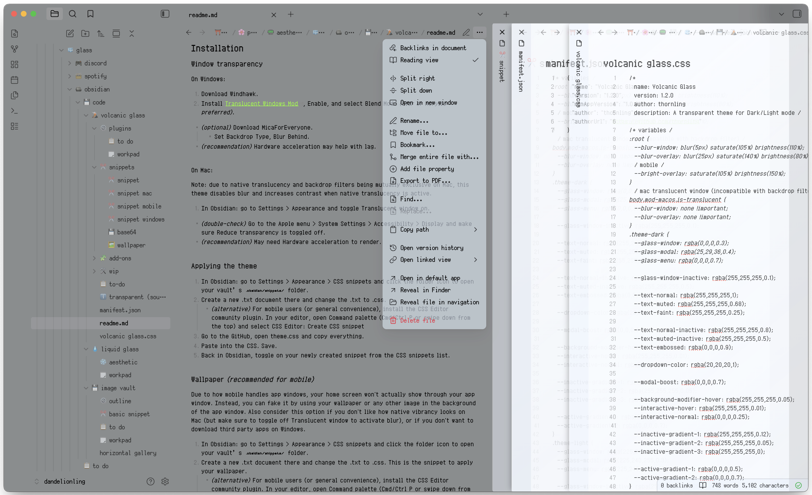
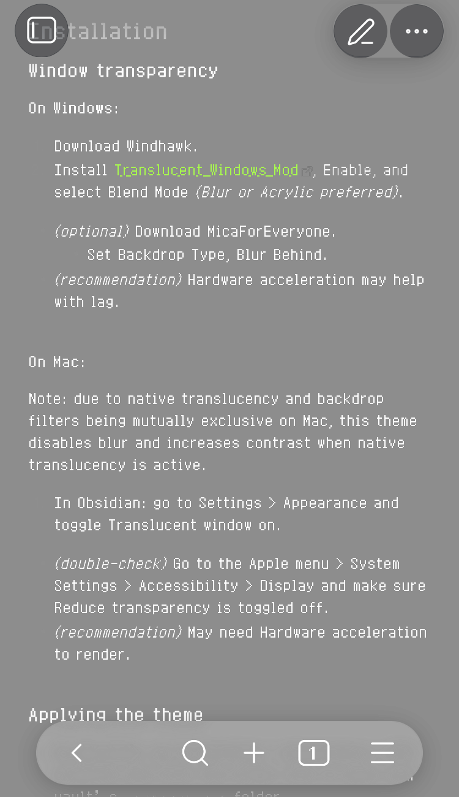
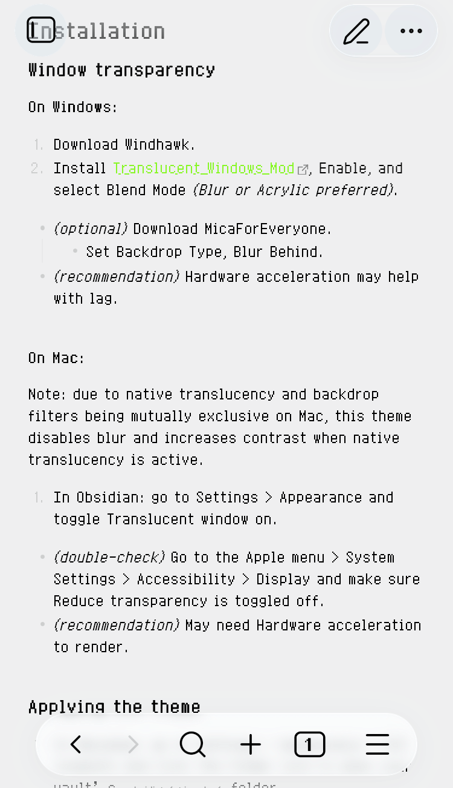

# Volcanic Glass
<p align="center">
  
</p>

## Description
A Dark/Light Mode transparent theme for Mac, Windows, and mobile. Compatible with background wallpapers.

## Gallery
<details>
<summary>(click to view)</summary>

###### Windows
<p align="center">
  
  
</p>

###### Mac
<p align="center">
  
  
</p>

###### Tablet
<p align="center">
  
  
</p>

###### Phone
<p align="center">
  
  
</p>

###### Sample Wallpaper
<p align="center">
  
</p>
source: 1041uuu
</details>

## Links
- [Obsidian](https://obsidian.md) – required
- [Volcanic Glass Theme](https://github.com/thornling/volcanic-glass-theme-for-obsidian/) – theme file
- [CSS Editor](https://github.com/Zachatoo/obsidian-css-editor) - community plugin *(optional)*
	- create/edit CSS snippets on mobile
###### Windows:
- [Windhawk](https://windhawk.net/) *(preferred)*
- MicaForEveryone *(optional)*
	- [GitHub](https://github.com/MicaForEveryone/MicaForEveryone) or [Windows Store](https://apps.microsoft.com/detail/9p8v68p4z78p?hl=en-US&gl=US)

## Installation
#### Window transparency
###### On Windows:
1. Download Windhawk.
2. Install [Translucent Windows Mod](https://windhawk.net/mods/translucent-windows), Enable, and select Blend Mode *(Blur or Acrylic preferred)*.
- *(optional)* Download MicaForEveryone.
	- Set Backdrop Type, Blur Behind.
- *(recommendation)* Hardware acceleration may help with lag.
###### On Mac:
Note: due to native translucency and backdrop filters being mutually exclusive on Mac, this theme disables blur and increases contrast when native translucency is active.
1. In Obsidian: go to Settings > Appearance and toggle Translucent window on.
- *(double-check)* Go to the Apple menu > System Settings > Accessibility > Display and make sure Reduce transparency is toggled off.
- *(recommendation)* May need Hardware acceleration to render.
#### Applying the theme
1. In Obsidian: go to Settings > Appearance > CSS snippets and click the folder icon to open your vault’s `.obsidian/snippets/` folder.
2. Create a new .txt document there and change the .txt to .css.
	- *(alternative)* For mobile users (or general convenience), install the CSS Editor community plugin. In your editor, open Command palette (Cmd/Ctrl P or swipe down from the top) and select CSS Editor: Create CSS snippet
3. Go to the GitHub, open theme.css and copy everything.
4. Paste into the CSS. Save.
5. Back in Obsidian, toggle on your newly created snippet from the CSS snippets list.
#### Wallpaper *(recommended for mobile)*
Due to how mobile handles app windows, your home screen won't actually show through your app window. Instead, you can fake it by using your wallpaper or any other image in the background of the app window. Also consider this option if you don't like how native vibrancy looks on Mac (but make sure to toggle off Translucent window to activate blur), or if you don't want to download third party apps on Windows.
1. In Obsidian: go to Settings > Appearance > CSS snippets and click the folder icon to open your vault’s `.obsidian/snippets/` folder.
2. Create a new .txt document there and change the .txt to .css. This is the snippet to apply your wallpaper.
	- *(alternative)* For mobile users (or general convenience), install the CSS Editor community plugin. In your editor, open Command palette (Cmd/Ctrl P or swipe down from the top) and select CSS Editor: Create CSS snippet
3. Paste this code and save:
```
body.obsidian-app {
  background-image: var(--wallpaper-image);
  background-size: cover;
  background-position: center;
  background-attachment: fixed;
}
```
- *(optional)* If you don't care about the wallpaper loading offline, you can replace `var(--wallpaper-image)` with `url('')`; just paste your url between the two single quotes and skip to step 7.
4. Make another CSS snippet. This defines the `wallpaper-image` variable with base64.
5. Paste this code and save:
```
:root {
  --wallpaper-image: url('data:image/png;base64,');
}
```
- *(double-check)* Make sure to replace `png` with your actual image type.
6. Find an online base64 converter. Upload your wallpaper, convert, and paste the code after `base64,` before the last single quote.
	- Note: base64 turns images into extremely long strings of text. You may experience lag or find it difficult to navigate a file that contains base64.
7. Back in Obsidian, toggle on your newly created snippet(s) from the CSS Snippets list.
#### Credits:
[Obsidian-Transparent](https://github.com/Oczko24/Obsidian-transparent) by Oczko24
#### Upcoming:
- Troubleshoot tablet blur flicker
- Wallpaper upload plugin
- Translucent stacks plugin
- Pseudo Mica (windowed wallpaper) plugin
- Style settings
